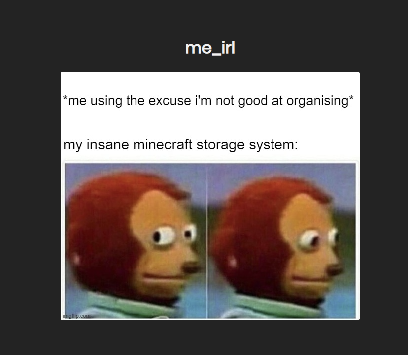
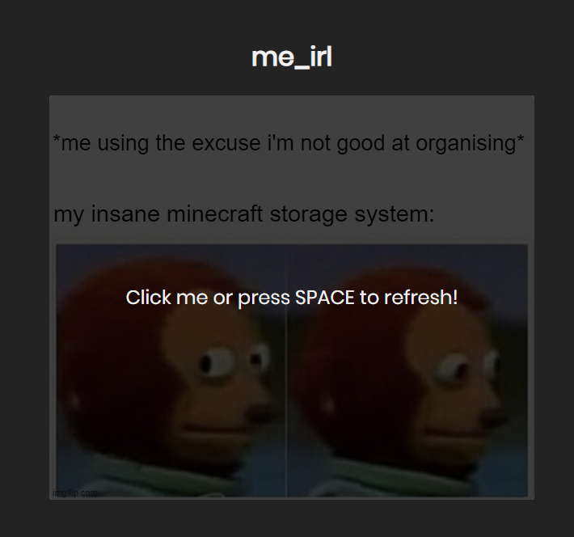

# Meme Fletcher

Fetches random memes from an API and displays them to you.

Made as a first project using React + TypeScript.

## Features

- Random memes

- That's it, that's all there is

- Refer to the first point

## TODO

- Create webpack configuration based on environment

- Add some nicer animations between memes

- Maybe add multi-meme drifting.

## Images

That's it, there is nothing more to this project. Just memes.

## License

Licensed under the [MIT](LICENSE.md) license.
